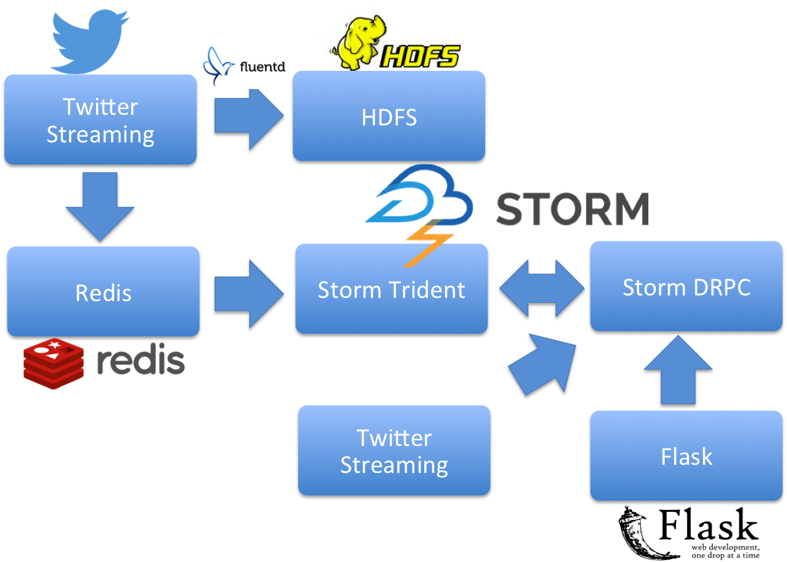

# Real-time #Hashtag Suggestion for Tweets

*Documentation is a work in progress*

##Introduction
Hashtags are used in almost all social networks as a way to classify topic. Especially, twitter hashtags are used extensively in trends & search and are part of social media economy. This project tries to suggest hashtags for tweets without hashtags. It is a unique way to appreciate users' creativity in creating interesting hashtags as well as helps boost tweets' visibility.

##Basic Idea
The basic idea is to take advantage of tweets that already have hashtags and make suggestions based on the similar tweets' hashtags. The problem is how to find similar tweets. A naive way is to calculate the cosine similarity between the new tweet and each of the old tweets, sort by cosine similarity and pick the top similar tweets. Apparently, this approach is not scalable as you can easily have millions of tweets. The approach implemented here is inspired by research in First Story Dectection (FSD) which basically tries to find the earliest news among all the news of the topic. It can summarize as use Location Sensitive Hashing (LSH) to put tweets that have hashtags into different buckets and because of LSH, the tweets in the same buckets are thought to be similar. Then we can apply the same procedure to the tweets that do not have hashtags and makes hashtag suggestions based only on the tweets that are in the same buckets which are less than a few hundred.

##Data Pipeline
The project is built on top of storm which is a perfect fit for streaming data. The data pipeline is as follows:

Twitter Streaming API is the data source. All the raw tweets are stored into HDFS as historical data. The text and hashtags are feed into Redis which acts as a task queue here. There are two Storm topology running here. One trident topology consumes tweets from Redis and put tweets into different buckets. Another DRPC topology waits for request from API call which can either sent from Tweet Streaming or web interface, and then return hashtags suggestions.

The trident topology which works with tweets that alreadly have hashtags are constantly reading tweets from Redis and after cleaning, transforming to TF-IDF vector and LSH, puts the tweets to different buckets. Topology is similar to job in Hadoop Mapreduce. The difference is that topology never ends. The blue ones are stateless functions and red ones are states which are kept undating as new tweets come. Trident is higher level abstraction over Storm Java API and works in a microbatching way. Storm provides falt tolerant as well as scaling.

The following picture shows the DRPC topology which responds to API request for hashtag suggestions. As you can see, for a new tweet that does not have hashtags, it first goes through the same process as Trident topology and finally arrives at certain buckets where it can find similar tweets. The only differe here is that DRPC topology only queries state produced by Trident Topology but does not update these states. Then the similar tweets are aggregated together and sorted by theire consine similarity with the new tweet and finally return. 

##Deploy
One of the committers of Storm project, Michael G. Noll, provides a detailed description about [Running a Multi-Node Storm Cluster](http://www.michael-noll.com/tutorials/running-multi-node-storm-cluster/). Also from this blog, the is a tool that provides a much eaiser deployment tool [Wirbelsturm](http://www.michael-noll.com/blog/2014/03/17/wirbelsturm-one-click-deploy-storm-kafka-clusters-with-vagrant-puppet/). As deployment through Wirbelsturm to EC2 is still in beta. I take the step by step way. To check the status of the cluster, use `sudo supervisorctl status` and you should see nimbus, supervisor, zookeeper in `RUNNING` status. See `deployment` dir for the nimbus and zookeeper's supervisord.conf.

##Demo

##Credits
The Location Sensitive Hashing (LSH) approach is directly influenced by [Michael Vogiatzis's work in first story detection](http://micvog.com/2013/09/08/storm-first-story-detection/) which again goes to various research in this field and most notably [this one](http://dl.acm.org/citation.cfm?id=1858020). All the referenced code are attributed with author.

##About

The project is a Maven project and developed in Eclipse.

	New Maven project : mvn archetype:generate -DgroupId=hastags -DartifactId=hashtags
	Download the package in pom.xml:	mvn eclipse:clean eclipse:eclipse
	Package to a jar (with dependencies): mvn clean package
	See pom.xml for all the dependencies and configuration.

To Test in local mode, run the following:
	
	storm dev-zookeeper &
	storm nimbus &
	storm supervisor &
	storm ui &
	storm drpc &
	storm jar target/hashtags-1.0-SNAPSHOT-jar-with-dependencies.jar hashtags.HashtagTopology
