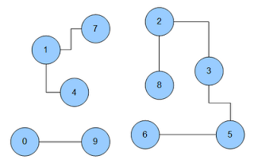

#Implementation of Graph Exploration using MapReduce

The Graph Exploration problem here refers to find the graph components (connected vertexes) in an undirected graph. The implementation here only uses Hadoop MapReduce Java API. You can see a more detailed description of the program and algorithm from [this link](http://codingwiththomas.blogspot.com/2011/04/graph-exploration-with-hadoop-mapreduce.html).

##Input and Output
Each vertex in the graph is denoted by an unique integer. The input is a text file in which each line represents a part of a component. The algorithm will assign all vertexes in a component the same id which is the vertexid of one of the vertex in that component.

For example, for the above graph which has three components ([1, 4, 7]; [2, 3, 5, 6, 8]; [0, 9]), we will have the following output:

	0 0
	1 1
	2 2
	3 2
	4 1
	5 2
	6 2
	7 1
	8 2
	9 0

##How it works
In short, the algorithm uses a technique called `message passing` to pass message of 'local minina' in order to find the global minina for each vertex. The connectivity information is preserved between iterations. Also, if a vertex's minina is updated, all of its neibouring vertexes will receive a message of the new minina. 'Counter' is used here to control when to stop the iteration, that is, when no vertex's minina is updated. 

Mapper will pass the connectivity information and broadcast new minina if the vertex is activated (found new global minina). Reducer update the new global minina for a vertex if necessary.

`Map input`: key is line number (or offset, unused); Depends on whether it is the first iteration, value can either be a vertex and all the vertexes that it points to (first iteration) or the vertex, all the vertexes that it points to as well as wehter it's global minima is updated.

`Map output`: key is the vertexId, value is the vertexes that it points to or local minima.

`Reduce input`: key is vertexid, values is the vertexes that this vertex points to or a local minima.

`Reduce output`: key is vertexid, value has 3 fields: the vertexes that this vertex points to, current global minima and wether it is updated in this iteration.

During each iteration, reducer will will write to a directory that mapper in the next iteration will be expected to read from according to current iteration level. The initial input path is hardcoded as 'xiaohu/graph/depth_0/'. To run the program, put the connectivity file in the format like 'graph.txt' under this directory in hdfs, then compile the program to a jar and use `Hadoop jar` command.

##File description
* `UserIdentifierNormalization.java`: Main function, contains the job configuation.
* `ExplorationMapper.java`          : Mapper class.
* `ExplorationReducer.java`         : Reducer class.
* `VertexWritable.java`			    : Value class that represents a vertex and a message at the same time.
* `graph.txt`					    : Sample input.